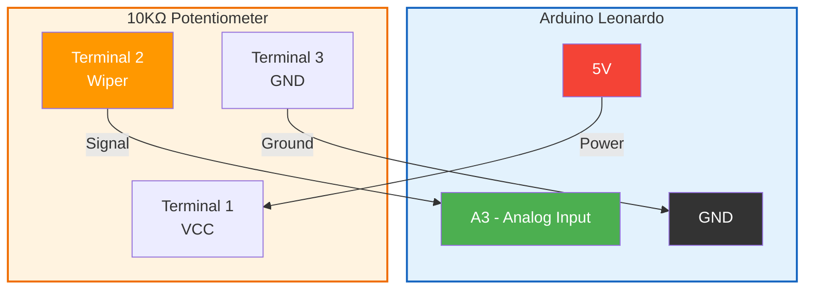
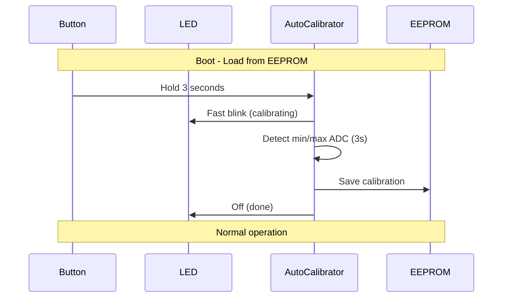
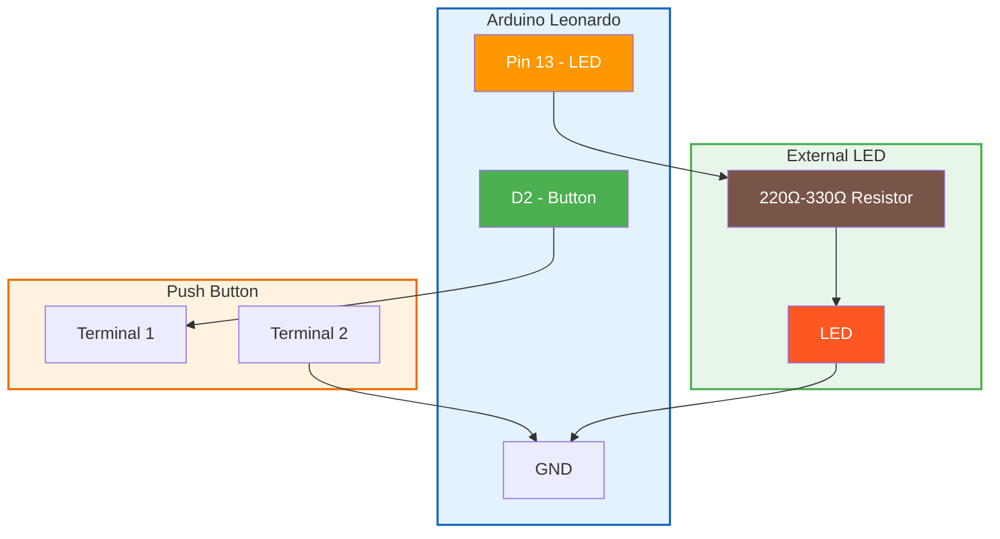
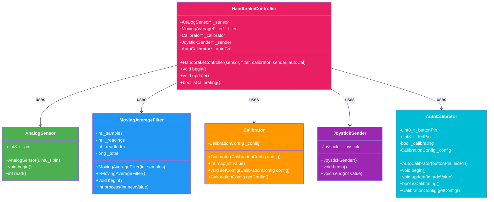
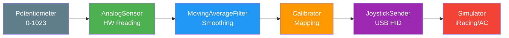
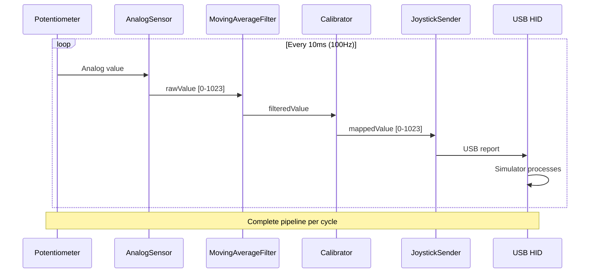

# Sim Handbrake

[](https://platformio.org/)
[](https://www.arduino.cc/en/Main/ArduinoBoardLeonardo)
[](LICENSE)

**USB handbrake simulator for sim racing.**

Converts the analog reading of a potentiometer into a USB joystick axis automatically recognized by racing simulators such as iRacing, Assetto Corsa, Gran Turismo, F1, and others.

---

## Table of contents

- [Features](#features)
- [Required hardware](#required-hardware)
- [Connection diagram](#connection-diagram)
- [Installation](#installation)
- [Usage](#usage)
- [Calibration](#calibration)
- [Software architecture](#software-architecture)
- [Project structure](#project-structure)
- [Class API](#class-api)
- [Configuration](#configuration)
- [Troubleshooting](#troubleshooting)
- [Future improvements](#future-improvements)
- [License](#license)

---

## Features

- ✅ **Native USB HID** - No additional drivers required
- ✅ **Noise filtering** - Configurable moving average for stable readings
- ✅ **Calibration** - Customizable potentiometer value mapping
- ✅ **High frequency** - 100Hz update rate (10ms)
- ✅ **SOLID architecture** - Modular and maintainable code
- ✅ **Compatible** - iRacing, Assetto Corsa, F1, Gran Turismo, etc.

---

## Required hardware

| Component | Quantity | Description |
|-----------|----------|-------------|
| Arduino Leonardo | 1 | Microcontroller with native USB (ATmega32U4) |
| Linear potentiometer | 1 | 10KΩ recommended (0-10KΩ) |
| Push button | 1 | Momentary tactile button (for calibration) |
| External LED | 1 | Status indicator (calibration feedback) |
| Resistor | 1 | 220Ω-330Ω for LED |
| USB cable | 1 | Micro-USB (data support, not charge-only) |
| Protoboard/Wires | - | For temporary connections |

### Compatibility

- **Arduino Leonardo** (recommended) - Native USB HID
- **Arduino Pro Micro** - Same ATmega32U4 chip
- **SparkFun Pro Micro** - Compatible alternative

> **Note**: Arduino Uno/Nano are not recommended for this application as they lack native USB HID.

---

## Connection diagram



### Detailed pinout

| Potentiometer | Arduino Leonardo |
|---------------|------------------|
| Terminal 1 (VCC) | 5V |
| Terminal 2 (Wiper) | A3 |
| Terminal 3 (GND) | GND |

---

## Installation

### Prerequisites

1. **PlatformIO** installed (CLI or VS Code)
2. **Arduino Leonardo** connected via USB

### Steps

```bash
# 1. Clone the repository
git clone https://github.com/adrianmarino/sim-handbreak.git
cd sim-handbreak

# 2. Install dependencies (automatic with PlatformIO)
pio run

# 3. Upload to Arduino
pio run -t upload

# 4. (Optional) Monitor serial output
pio device monitor
```

### From VS Code

1. Open the project folder in VS Code
2. Install PlatformIO IDE extension
3. Click "Upload" (up arrow icon)
4. Click "Serial Monitor" to view logs

---

## Usage

### Verification on Windows

1. Connect the Arduino Leonardo
2. Open **Control Panel** → **Devices and Printers**
3. Find "Handbrake" in the list
4. Test axes by moving the potentiometer

### Verification on Linux

```bash
# Install testing tool
sudo apt install joystick

# Test the joystick
jstest /dev/input/js0
```

### Verification on macOS

```bash
# Use JoyStick Show
open "JoyStick Show.app"
```

### Configure in simulators

1. **iRacing**: Options → Calibrate handbrake → Assign axis
2. **Assetto Corsa**: Options → Controls → Handbrake → Assign axis
3. **F1**: Options → Control settings → Handbrake → Assign axis
4. **Gran Turismo**: Settings → Controls → Handbrake

---

## Calibration

### Auto-calibration (recommended)

The system supports automatic calibration via external button:

1. **Hold calibration button for 3 seconds** → LED starts fast blinking
2. **Move handbrake through full range** (rest to full pull) during calibration
3. **Wait 3 seconds** → LED stops blinking, calibration saved to EEPROM
4. **Reboot** → Calibration persists automatically



#### Calibration hardware

| Component | Pin | Description |
|-----------|-----|-------------|
| Calibration button | D2 | Momentary push button (INPUT_PULLUP) |
| Status LED | 13 | External LED with 220Ω-330Ω resistor |

> **Important**: Since the Arduino is inside the case, use an external LED with a 220Ω-330Ω resistor in series for calibration feedback.



#### How it works

- **On boot**: System checks EEPROM for saved calibration
- **If valid**: Uses saved values (no recalibration needed)
- **If empty**: Uses default values (945/735) until calibration
- **Button press**: Hold 3 seconds to enter calibration mode
- **During calibration**: ADC min/max detected over 3 seconds
- **After calibration**: Values saved to EEPROM (5 bytes)

#### EEPROM storage

| Address | Size | Content |
|---------|------|---------|
| 0x00 | 1 byte | Magic byte (0xA5 = valid) |
| 0x01 | 2 bytes | inputMin (uint16) |
| 0x03 | 2 bytes | inputMax (uint16) |

### Manual calibration (alternative)

If you prefer manual calibration without the button:

1. **Measure rest value** (without touching the handbrake):
   ```bash
   # With Arduino connected, open serial monitor
   pio device monitor
   # Note the value when the handbrake is released
   ```

2. **Measure full scale value** (full handbrake pull):
   ```bash
   # Pull the handbrake completely
   # Note the maximum value
   ```

3. **Update constants** in `src/main.cpp`:
   ```cpp
   const int ADC_REPOSO = 950;    // Your measured value
   const int ADC_A_FONDO = 720;   // Your measured value
   ```

4. **Recompile and upload**:
   ```bash
   pio run -t upload
   ```

### Fine-tuning

If the range is not linear, you can adjust values in `CalibrationConfig`:

```cpp
CalibrationConfig config = {
    .inputMin = 950,    // Measured rest value
    .inputMax = 720,    // Measured full scale value
    .outputMin = 0,     // Joystick minimum
    .outputMax = 1023   // Joystick maximum
};
```

---

## Software architecture

### SOLID principles applied

| Principle | Implementation |
|-----------|----------------|
| **SRP** | Each class has ONE responsibility |
| **OCP** | Calibrator extensible with CalibrationConfig |
| **LSP** | Interchangeable components |
| **ISP** | Small and specific interfaces |
| **DIP** | Dependency injection in HandbrakeController |

### Class diagram



### Data flow



### Sequence diagram



### Design patterns

- **Facade**: HandbrakeController orchestrates the entire pipeline
- **Dependency Injection**: Components injected via pointers
- **Single Responsibility**: Each class does one thing

---

## Project structure

```
sim-handbreak/
├── src/
│   └── main.cpp                    # Entry point - configuration only
├── lib/
│   └── handbrake/                  # Core library
│       ├── include/
│       │   └── handbrake/
│       │       ├── AnalogSensor.h      # Hardware reading
│       │       ├── MovingAverageFilter.h  # Signal filtering
│       │       ├── Calibrator.h        # Value mapping
│       │       ├── AutoCalibrator.h    # Auto-calibration with EEPROM
│       │       ├── JoystickSender.h    # USB sending
│       │       └── HandbrakeController.h # Orchestrator
│       └── src/
│           ├── AnalogSensor.cpp
│           ├── MovingAverageFilter.cpp
│           ├── Calibrator.cpp
│           ├── AutoCalibrator.cpp
│           ├── JoystickSender.cpp
│           └── HandbrakeController.cpp
├── platformio.ini                 # PlatformIO configuration
├── AGENTS.md                      # Agent documentation
└── README.md                      # This file
```

---

## Class API

### AnalogSensor

```cpp
AnalogSensor sensor(A3);  // Analog pin
sensor.begin();           // Initialize
int value = sensor.read(); // Read [0-1023]
```

### MovingAverageFilter

```cpp
MovingAverageFilter filter(8);  // 8 samples
filter.begin();                 // Initialize
int filtered = filter.process(rawValue);  // Filter
```

### Calibrator

```cpp
CalibrationConfig config = {945, 735, 0, 1023};
Calibrator calibrator(config);
int mapped = calibrator.map(filteredValue);  // Map
calibrator.setConfig(newConfig);             // Update config at runtime
CalibrationConfig current = calibrator.getConfig();  // Get current config
```

### AutoCalibrator

```cpp
AutoCalibrator autoCal(2, 13);  // Button on pin 2, LED on pin 13
autoCal.begin();                // Load from EEPROM

// In loop:
autoCal.update(filteredValue);  // Update button state and calibration
if (autoCal.isCalibrating()) {
    // Skip normal handbrake update
    return;
}
CalibrationConfig config = autoCal.getConfig();  // Get current config
```

### JoystickSender

```cpp
JoystickSender sender;
sender.begin();      // Initialize USB
sender.send(value);  // Send Ry axis
```

### HandbrakeController

```cpp
HandbrakeController handbrake(&sensor, &filter, &calibrator, &sender, &autoCal);
handbrake.begin();          // Initialize all components
handbrake.update();         // Run full pipeline
handbrake.isCalibrating();  // Check if in calibration mode
```

---

## Configuration

### Main parameters

| File | Constant | Value | Description |
|------|----------|-------|-------------|
| `main.cpp` | `POT_PIN` | A3 | Potentiometer analog pin |
| `main.cpp` | `FILTER_SAMPLES` | 8 | Filter window size |
| `main.cpp` | `CALIBRATION_BUTTON_PIN` | 2 | Calibration button (INPUT_PULLUP) |
| `main.cpp` | `CALIBRATION_LED_PIN` | 13 | Status LED (built-in) |
| `main.cpp` | `ADC_REPOSO` | 945 | Default ADC value at rest |
| `main.cpp` | `ADC_A_FONDO` | 735 | Default ADC value at full scale |

### Update frequency

The system operates at **100Hz** (10ms interval):

```cpp
delay(10);  // 1000ms / 10ms = 100Hz
```

### USB configuration

In `platformio.ini`:

```ini
board_build.usb_product = "Handbrake"
board_build.usb_manufacturer = "Adrian"
```

---

## Troubleshooting

### Joystick not detected

1. Verify USB cable supports data (not charge-only)
2. Try another USB port
3. Check `board_build.usb_product` is configured in `platformio.ini`

### Unstable readings

1. **Increase FILTER_SAMPLES** (e.g.: 16 or 32)
2. **Check connections** - loose wires cause noise
3. **Add capacitor** - 100nF between A3 and GND

### Inverted values

If the handbrake works in reverse, swap the values:

```cpp
const int ADC_REPOSO = 735;    // Was ADC_A_FONDO
const int ADC_A_FONDO = 945;   // Was ADC_REPOSO
```

### Build fails

```bash
# Clean and rebuild
pio run -t clean && pio run

# Check installed libraries
pio pkg list
```

### Upload fails

1. Press reset button **twice quickly** on the Arduino
2. Upload immediately:
   ```bash
   pio run -t upload
   ```

---

## Future improvements

- [ ] **Configurable deadzone** - Center deadzone
- [ ] **Multiple presets** - Save configurations to EEPROM
- [ ] **Auto-calibration** - Automatic routine on startup
- [ ] **LED indicator** - Handbrake status
- [ ] **Multiple axes** - Assign to different USB axes
- [ ] **OTA firmware** - WiFi updates (ESP32)
- [ ] **Analog/digital mode** - Mode switching
- [ ] **Response curve** - Linear/exponential configuration

---

## Contributing

1. Fork the project
2. Create branch (`git checkout -b feature/new-feature`)
3. Commit (`git commit -m 'Add new feature'`)
4. Push (`git push origin feature/new-feature`)
5. Open Pull Request

---

## License

MIT License - See [LICENSE](LICENSE) for details.

---

## Credits

- [mheironimus/Joystick](https://github.com/mheironimus/Joystick) - USB HID Joystick library
- [PlatformIO](https://platformio.org/) - Build system
- [Arduino](https://www.arduino.cc/) - Hardware platform