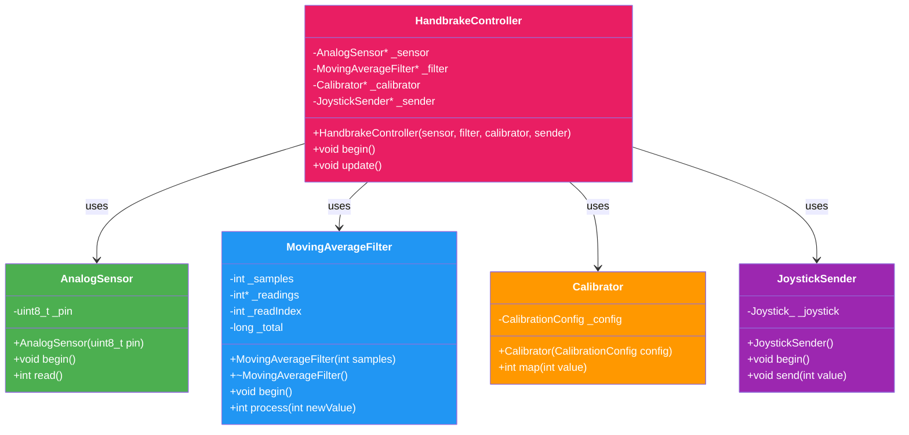
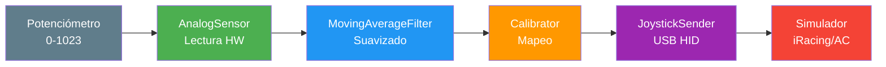
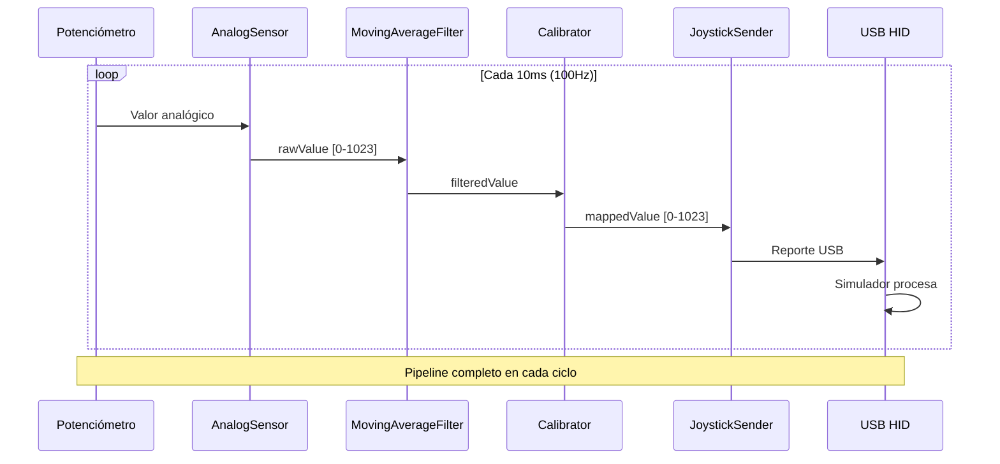

# Sim Handbrake

[](https://platformio.org/)
[](https://www.arduino.cc/en/Main/ArduinoBoardLeonardo)
[](LICENSE)

**Simulador de freno de mano USB para sim racing.**

Convierte la lectura analógica de un potenciómetro en un eje de joystick USB reconocido automáticamente por simuladores de carreras como iRacing, Assetto Corsa, Gran Turismo, F1, entre otros.

---

## Tabla de contenidos

- [Características](#características)
- [Hardware requerido](#hardware-requerido)
- [Diagrama de conexión](#diagrama-de-conexión)
- [Instalación](#instalación)
- [Uso](#uso)
- [Calibración](#calibración)
- [Arquitectura del software](#arquitectura-del-software)
- [Estructura del proyecto](#estructura-del-proyecto)
- [API de clases](#api-de-clases)
- [Configuración](#configuración)
- [Solución de problemas](#solución-de-problemas)
- [Mejoras futuras](#mejoras-futuras)
- [Licencia](#licencia)

---

## Características

- ✅ **USB HID nativo** - No requiere drivers adicionales
- ✅ **Filtro de ruido** - Media móvil configurable para lecturas estables
- ✅ **Calibración** - Mapeo personalizable de valores del potenciómetro
- ✅ **Alta frecuencia** - Actualización a 100Hz (10ms)
- ✅ **Arquitectura SOLID** - Código modular y mantenible
- ✅ **Compatible** - iRacing, Assetto Corsa, F1, Gran Turismo, etc.

---

## Hardware requerido

| Componente | Cantidad | Descripción |
|------------|----------|-------------|
| Arduino Leonardo | 1 | Microcontrolador con USB nativo (ATmega32U4) |
| Potenciómetro lineal | 1 | 10KΩ recomendado (0-10KΩ) |
| Cable USB | 1 | Micro-USB (soporte datos, no solo carga) |
| Protoboard/Cables | - | Para conexiones temporales |

### Compatibilidad

- **Arduino Leonardo** (recomendado) - USB HID nativo
- **Arduino Pro Micro** - Mismo chip ATmega32U4
- **SparkFun Pro Micro** - Alternativa compatible

> **Nota**: No se recomienda Arduino Uno/Nano para esta aplicación ya que no tienen USB HID nativo.

---

## Diagrama de conexión


### Pinout detallado

| Potenciómetro | Arduino Leonardo |
|---------------|------------------|
| Terminal 1 (VCC) | 5V |
| Terminal 2 (Wiper) | A3 |
| Terminal 3 (GND) | GND |

---

## Instalación

### Requisitos previos

1. **PlatformIO** instalado (CLI o VS Code)
2. **Arduino Leonardo** conectado via USB

### Pasos

```bash
# 1. Clonar el repositorio
git clone https://github.com/tu-usuario/sim-handbreak.git
cd sim-handbreak

# 2. Instalar dependencias (automático con PlatformIO)
pio run

# 3. Subir al Arduino
pio run -t upload

# 4. (Opcional) Monitorear serial
pio device monitor
```

### Desde VS Code

1. Abrir la carpeta del proyecto en VS Code
2. Instalar extensión PlatformIO IDE
3. Click en "Upload" (flecha hacia arriba)
4. Click en "Serial Monitor" para ver logs

---

## Uso

### Verificación en Windows

1. Conectar el Arduino Leonardo
2. Abrir **Panel de control** → **Dispositivos de juego**
3. Buscar "Handbrake" en la lista
4. Probar los ejes moviendo el potenciómetro

### Verificación en Linux

```bash
# Instalar herramienta de prueba
sudo apt install joystick

# Probar el joystick
jstest /dev/input/js0
```

### Verificación en macOS

```bash
# Usar JoyStick Show
open "JoyStick Show.app"
```

### Configurar en simuladores

1. **iRacing**: Opciones → Calibrar freno de mano → Asignar eje
2. **Assetto Corsa**: Opciones → Controles → Freno de mano → Asignar eje
3. **F1**: Opciones → Ajustes de control → Freno de mano → Asignar eje
4. **Gran Turismo**: Ajustes → Controles → Freno de mano

---

## Calibración

### Valores por defecto

```cpp
const int ADC_REPOSO = 945;    // Valor ADC en reposo
const int ADC_A_FONDO = 735;   // Valor ADC a fondo de escala
```

### Proceso de calibración

1. **Medir valor en reposo** (sin tocar el freno):
   ```bash
   # Con Arduino conectado, abrir monitor serial
   pio device monitor
   # Anotar el valor cuando el freno está suelto
   ```

2. **Medir valor a fondo de escala** (freno total):
   ```bash
   # Tirar del freno completamente
   # Anotar el valor máximo
   ```

3. **Actualizar constantes** en `src/main.cpp`:
   ```cpp
   const int ADC_REPOSO = 950;    // Tu valor medido
   const int ADC_A_FONDO = 720;   // Tu valor medido
   ```

4. **Recompilar y subir**:
   ```bash
   pio run -t upload
   ```

### Ajuste fino

Si el rango no es lineal, puedes ajustar los valores en `CalibrationConfig`:

```cpp
CalibrationConfig config = {
    .inputMin = 950,    // Valor reposo medido
    .inputMax = 720,    // Valor fondo medido
    .outputMin = 0,     // Mínimo joystick
    .outputMax = 1023   // Máximo joystick
};
```

---

## Arquitectura del software

### Principios SOLID aplicados

| Principio | Implementación |
|-----------|----------------|
| **SRP** | Cada clase tiene UNA responsabilidad |
| **OCP** | Calibrator extensible con CalibrationConfig |
| **LSP** | Componentes intercambiables |
| **ISP** | Interfaces pequeñas y específicas |
| **DIP** | Inyección de dependencias en HandbrakeController |

### Diagrama de clases



### Flujo de datos



### Diagrama de secuencia



### Patrones de diseño

- **Facade**: HandbrakeController orquesta todo el pipeline
- **Dependency Injection**: Componentes inyectados por puntero
- **Single Responsibility**: Cada clase hace una cosa

---

## Estructura del proyecto

```
sim-handbreak/
├── src/
│   └── main.cpp                    # Punto de entrada - solo configuración
├── lib/
│   └── handbrake/                  # Biblioteca principal
│       ├── include/
│       │   └── handbrake/
│       │       ├── AnalogSensor.h      # Lectura de hardware
│       │       ├── MovingAverageFilter.h  # Filtrado de señal
│       │       ├── Calibrator.h        # Mapeo y calibración
│       │       ├── JoystickSender.h    # Envío USB
│       │       └── HandbrakeController.h # Orquestador
│       └── src/
│           ├── AnalogSensor.cpp
│           ├── MovingAverageFilter.cpp
│           ├── Calibrator.cpp
│           ├── JoystickSender.cpp
│           └── HandbrakeController.cpp
├── platformio.ini                 # Configuración PlatformIO
├── AGENTS.md                      # Documentación para agentes
└── README.md                      # Este archivo
```

---

## API de clases

### AnalogSensor

```cpp
AnalogSensor sensor(A3);  // Pin analógico
sensor.begin();           // Inicializar
int value = sensor.read(); // Leer [0-1023]
```

### MovingAverageFilter

```cpp
MovingAverageFilter filter(8);  // 8 muestras
filter.begin();                 // Inicializar
int filtered = filter.process(rawValue);  // Filtrar
```

### Calibrator

```cpp
CalibrationConfig config = {945, 735, 0, 1023};
Calibrator calibrator(config);
int mapped = calibrator.map(filteredValue);  // Mapear
```

### JoystickSender

```cpp
JoystickSender sender;
sender.begin();      // Inicializar USB
sender.send(value);  // Enviar eje Ry
```

### HandbrakeController

```cpp
HandbrakeController handbrake(&sensor, &filter, &calibrator, &sender);
handbrake.begin();   // Inicializar todo
handbrake.update();  // Ejecutar pipeline completo
```

---

## Configuración

### Parámetros principales

| Archivo | Constante | Valor | Descripción |
|---------|-----------|-------|-------------|
| `main.cpp` | `POT_PIN` | A3 | Pin analógico del potenciómetro |
| `main.cpp` | `FILTER_SAMPLES` | 8 | Tamaño de ventana del filtro |
| `main.cpp` | `ADC_REPOSO` | 945 | Valor ADC en reposo |
| `main.cpp` | `ADC_A_FONDO` | 735 | Valor ADC a fondo de escala |

### Frecuencia de actualización

El sistema opera a **100Hz** (intervalo de 10ms):

```cpp
delay(10);  // 1000ms / 10ms = 100Hz
```

### Configuración USB

En `platformio.ini`:

```ini
board_build.usb_product = "Handbrake"
board_build.usb_manufacturer = "Adrian"
```

---

## Solución de problemas

### El joystick no aparece

1. Verificar que el cable USB soporte datos
2. Probar otro puerto USB
3. Verificar que `board_build.usb_product` esté configurado

### Lecturas inestables

1. **Aumentar FILTER_SAMPLES** (ej: 16 o 32)
2. **Verificar conexiones** - cables flojos causan ruido
3. **Agregar condensador** de 100nF entre A3 y GND

### Valores invertidos

Si el freno funciona al revés, intercambiar los valores:

```cpp
const int ADC_REPOSO = 735;    // Antes era ADC_A_FONDO
const int ADC_A_FONDO = 945;   // Antes era ADC_REPOSO
```

### Compilación fallida

```bash
# Limpiar y recompilar
pio run -t clean && pio run

# Verificar librerías instaladas
pio pkg list
```

### Upload fallido

1. Presionar botón de reset **dos veces rápido** en el Arduino
2. Ejecutar upload inmediatamente:
   ```bash
   pio run -t upload
   ```

---

## Mejoras futuras

- [ ] **Zona muerta configurable** - Deadzone para el centro
- [ ] **Múltiples presets** - Guardar configuraciones en EEPROM
- [ ] **Auto-calibración** - Rutina automática al iniciar
- [ ] **LED indicador** - Estado del freno de mano
- [ ] **Múltiples ejes** - Asignar a diferentes ejes USB
- [ ] **Firmware OTA** - Actualización via WiFi (ESP32)
- [ ] **Modo analógico/digital** - Cambio entre modos
- [ ] **Curva de respuesta** - Configurar lineal/exponencial

---

## Contribuir

1. Fork el proyecto
2. Crear branch (`git checkout -b feature/nueva-funcionalidad`)
3. Commit (`git commit -m 'Agregar nueva funcionalidad'`)
4. Push (`git push origin feature/nueva-funcionalidad`)
5. Abrir Pull Request

---

## Licencia

MIT License - Ver [LICENSE](LICENSE) para detalles.

---

## Créditos

- [mheironimus/Joystick](https://github.com/mheironimus/Joystick) - Librería USB HID Joystick
- [PlatformIO](https://platformio.org/) - Sistema de build
- [Arduino](https://www.arduino.cc/) - Plataforma de hardware